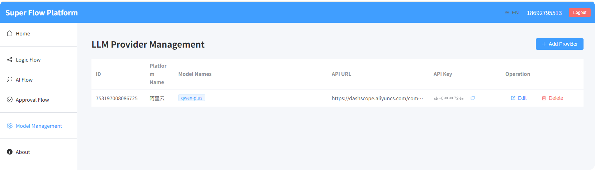

# mini-ai-workflow

**中文文档** | [English README](README.en.md)

A ready-to-use mini AI workflow designer developed using .NET 10 and Vue 3 (currently focused on flow/process design), which can, to some extent, replace Dify.

## 项目简介

`mini-ai-workflow` 是一个用于搭建 AI 工作流的可视化流程编排工具，前端基于 Vue 3 与 LogicFlow 实现流程设计与调试，后端基于 .NET 10（ASP.NET Core Web API）。当前仓库已同时包含前端与后端完整代码，可直接本地运行与调试。

本仓库定位为一个相对**简单的演示项目**：核心代码力求做到尽量健壮、易扩展，但本仓库本身**不再持续更新**，更多用作示例和学习参考。  
未来可能会提供一个单独的**付费小版本**，在此开源版本基础上增加少量增值功能，例如：

- **请求日志记录**：更完善的请求/响应日志与审计能力
- **调用其他 AI 工作流节点**：支持与其他 AI 工作流系统做节点级联动

本开源项目已经开放了最核心、最关键的代码，付费版本只是多了一点点“锦上添花”的功能。  
如果这个小项目刚好帮到你、又不差这点小钱，欢迎顺手**支持作者一把**，算是给后续继续折腾一些有意思的小工具一点动力。

## 技术栈

### 前端

- **框架**：Vue 3 + TypeScript
- **构建工具**：Vite
- **UI 组件库**：Element Plus
- **路由管理**：Vue Router
- **状态管理**：Pinia
- **HTTP 请求**：Axios
- **流程编排**：@logicflow/core, @logicflow/extension
- **代码编辑器**：CodeMirror（含 JavaScript 语言支持）
- **国际化**：vue-i18n（中英文多语言）
- **JSON 展示**：vue3-json-viewer
- **Markdown 渲染**：marked

> 前端代码位于 `front` 目录，整体依赖均为开源库。

### 后端

- **运行时与框架**：.NET 10 / ASP.NET Core Web API
- **依赖库（核心）**：
  - `Jint`（JavaScript 运行时，用于流程中脚本执行）
- **基础设施与封装**：
  - 自定义 WebAPI 框架：`Nop.WebApiFramework`
  - 通用基础库：`Nop.Infrastructure`
  - 日志：Serilog + 控制台输出 + 可选 Seq
  - 可选链路追踪：OpenTelemetry（Zipkin 等）
- **数据存储**：
  - 数据库：MySQL（通过 `FreeSql` 封装，默认库名 `aiworkflow`）
  - 可选缓存：Redis（连接字符串可在配置中修改）, 目前没有用上.

> 后端代码位于 `backend/SuperFlowApi` 目录，其它通用基础库位于 `backend/DotnetLabs`。

## 本地运行（前端）

### 环境要求

- **Node.js**：建议 ≥ 18
- **包管理器**：npm（或兼容的 pnpm / yarn，自行替换命令）

### 启动步骤

在项目根目录下执行：

```bash
cd front

# 安装依赖
npm install

# 启动开发服务器
npm run dev

# 构建生产版本
npm run build
```

### 后端地址配置

- 开发环境默认后端地址：`http://localhost:30050`
- 可在前端项目根目录创建或修改 `.env.development` 文件，配置后端 API 基础地址，例如：

```bash
VITE_API_BASE_URL=http://localhost:30050
```

如已有封装好的 `http.util.ts` / 配置文件，请确保其中的基础地址与后端实际监听地址一致。

## 本地运行（后端）

### 环境要求

- **.NET SDK**：需安装 .NET 10 SDK（包含 `dotnet` CLI）
- **数据库**：MySQL（推荐 5.7+/8.0+），默认连接信息如下，可按需修改：
  - 服务器：`localhost`
  - 端口：`3306`
  - 数据库：`aiworkflow`
  - 用户名：`root`
  - 密码：`sa1234`
- （可选）**Redis**：本地 `127.0.0.1:6379`，用于缓存相关功能

> 数据库与连接字符串可在 `backend/SuperFlowApi/appsettings.Development.json` 中的 `FreeSqlDatabase` 与 `ConnectionStrings` 节点修改。

### 启动步骤

在项目根目录执行：

```bash
cd backend/SuperFlowApi

# 还原依赖（首次或更新依赖后执行）
dotnet restore

# 以开发环境启动，使用 launchSettings 中的 http 配置（默认 http://localhost:30050）
dotnet run
```

成功启动后，你应能在终端看到 ASP.NET Core 启动日志，默认监听地址为：`http://localhost:30050`。

## 前后端联调说明

1. 启动后端（见“本地运行（后端）”章节），确保监听地址为 `http://localhost:30050` 或与你在前端环境变量中配置的地址一致。
2. 前端登录、流程设计、执行等 API 调用会通过前端封装的 HTTP 工具转发到后端 API，如遇 CORS 或网络错误，请确认：
   - 后端已启动且端口正确
   - 前端环境变量中 API 基础地址配置正确
   - 浏览器网络面板中请求 URL 与后端实际地址一致

## 模型配置重要提示

- **在使用任意 LLM 节点之前，必须先完成大模型配置**，否则画布中的 LLM 相关节点将无法正常工作。
- 当前代码仅支持（并仅实际测试过）**阿里云系的大模型/向量服务**，例如：通义千问等。
- 请根据你在阿里云控制台中创建的凭证信息，正确填写后端中的模型访问配置（密钥、Base URL、模型名称等）。
- 如后续扩展/适配其他厂商模型，请在对应的配置与代码中进行修改，并确保在 README 中同步说明。

> 建议在首次运行项目前，优先完成模型配置与连通性测试。

对应界面示意图（仅为示例，实际界面请以运行结果为准）：



## 产品预览

下面是本项目运行时的部分页面预览，用于帮助你快速了解整体交互与主要功能布局：


## 登录说明

- **用户名**：使用中国大陆手机号码格式（11 位手机号，例如 `13800001234`）。
- **密码**：任意字符串即可（仅作示例用途）。
- **登录即注册**：如果手机号未注册，则第一次登录会自动完成注册，无需单独注册流程。

上述登录规则仅适用于本项目的演示/开发环境，请勿使用真实重要密码。
